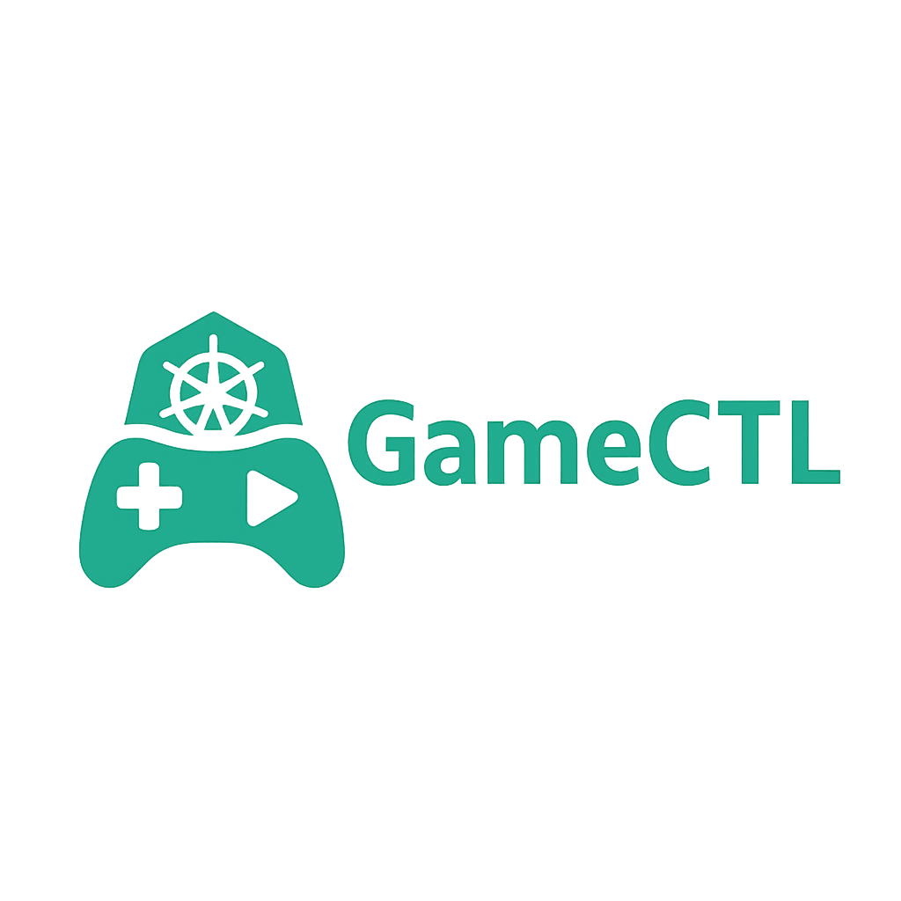
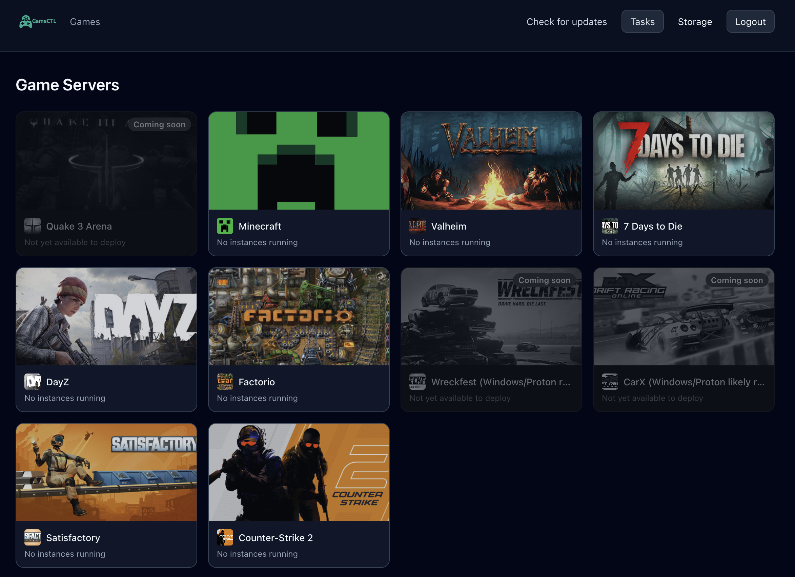
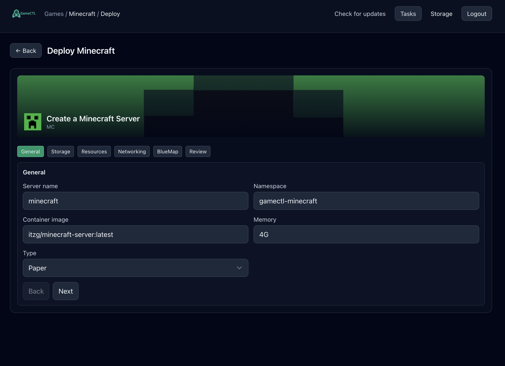
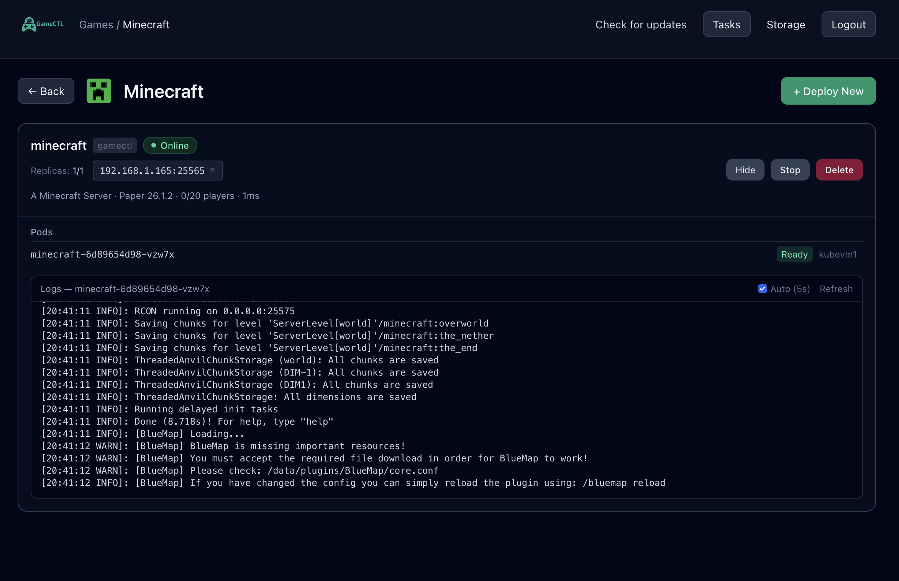

<div align="center">



**Self-hosted game server orchestration for Kubernetes.**

Deploy, manage, and monitor dedicated game servers from a single binary —
a guided wizard, live task tracking, and real server health, no YAML wrangling.

🌐 **[gamectl.cc](https://gamectl.cc)** &nbsp;·&nbsp; 🚀 **Public beta — `v0.0.19-beta`**

</div>

---

GameCTL turns "deploy a game server on Kubernetes" from a wall of manifests into a few clicks. It runs as one Go binary with an embedded React UI, talks to your cluster through an in-cluster ServiceAccount, and shows you exactly what it's doing every step of the way.

> **Beta software.** This is the public-facing core of GameCTL, currently
> at `v0.0.19-beta`. It's stable enough for day-to-day self-hosting and
> close in feel to a 1.0, but it is still beta — APIs, templates, and
> structure may change between beta revisions. Full project info and
> updates live at **[gamectl.cc](https://gamectl.cc)**.

---

## ⚡ Install

One command, against your current `kubectl` context:

```bash
curl -fsSL https://gamectl.cc/install.sh | bash
```

Zero config — it pulls the public image, detects your cluster's
networking (MetalLB / ingress), applies the manifest, and walks you
through first-run admin setup. Full walkthrough, options, and the
no-script manifest path are in the **Deploy to Kubernetes** section below.

> **Tested on k3s.** GameCTL targets any conformant Kubernetes 1.28+,
> but the installer's bootstrap helpers (auto-detected ingress,
> optional MetalLB install, k3s kubeconfig-permission fix) are shaped
> around k3s — the easiest path from "blank Linux box" to "running
> GameCTL". Other distros (microk8s, kubeadm, EKS/GKE/AKS, kind) work
> too; you may skip the MetalLB step on cloud providers and provide
> your own kubeconfig.

> `https://gamectl.cc/install.sh` is a 302 redirect to the canonical
> script at `raw.githubusercontent.com/GameCTL-HQ/GameCTL/main/scripts/install.sh`,
> which also keeps working directly if you prefer the raw URL.

---

## ✨ Why GameCTL

- **A few clicks, not a wall of YAML** — per-game wizards with sane, overridable defaults
- **Watchable operations** — every apply and delete is a tracked, phase-by-phase background task
- **Honest lifecycle** — deletes actually clean up, and only ever touch resources GameCTL owns
- **Live server health** — real game-protocol probes, not just "pod is running"
- **One binary** — API + UI in a single container; nothing else to host
- **Homelab-friendly, cluster-ready** — scales from a single node to multi-node Kubernetes

---

## 📸 Screenshots

<p align="center">
  <br>
  <em>Game hub — every supported server, live instance counts, one click to deploy</em>
</p>

<table>
  <tr>
    <td width="50%" valign="top">
      <br>
      <em>Guided per-game deploy wizard</em>
    </td>
    <td width="50%" valign="top">
      <br>
      <em>Live status, streaming logs &amp; lifecycle controls</em>
    </td>
  </tr>
</table>

---

## 🔧 Feature Set

### 🧙 Uniform Multi-Step Deploy Wizard
- Every game uses the **same guided flow** — general → storage → networking
  → review — driven by per-game schemas, so a new title feels familiar
- Generates complete, inspectable manifests (Namespace, PV, PVC, Deployment, Service)
- The review step shows the exact YAML before anything touches the cluster
- NFS or local `hostPath` storage modes; the target directory is
  **auto-provisioned on first deploy** so there's no manual `mkdir`/`chown` dance
- On a successful deploy, a short countdown hands you **straight into the
  manage screen** for the new server — no hunting for it afterward

### ⏳ Background Task System
- Apply and delete run **asynchronously** — no frozen "Applying…" spinner, no silent timeouts
- A header **Tasks** menu shows live progress from any page
- Every task breaks into **phases** with per-step status and timing:
  `Ensure NFS path …` → `Apply Namespace/…` → `Apply Deployment/…` → done
- Click any task for a detail view that streams updates until it completes
- Long-running tasks can be **cancelled** mid-flight from the task view

### 🗂 Safe, Complete Lifecycle Management
- **Delete is a full sweep** — Deployment, Service, PVC, PV, and Namespace
- Waits for resources to truly terminate before reporting success, so the UI matches reality
- **Ownership-guarded** — only namespaces labeled as GameCTL-managed can be removed; an unrelated namespace can never be wiped by accident
- Delete is a **tracked task** — same phase-by-phase progress as deploy, so you watch it tear down
- Optional **"also delete data"** toggle — off by default, so world/save
  data survives a redeploy; when on, the backing NFS/local directory is
  wiped too
- Per-game manage screen: scale, stop/start, inspect pods, tail logs

### 🔄 Per-Instance Updates & Credentials
- Each server's manage screen has an **Updates & credentials** panel
- A per-instance **auto-update toggle** controls whether the server pulls
  a newer game-server image / runs its update path on (re)start, per game
- Update controls are wired to the env vars each game's image actually
  reads (e.g. SteamCMD-backed titles), so the toggle does what it says
- Server credentials/connection details are surfaced in one place instead
  of being buried in pod env

### 🩺 Live Server Health
- Synthesized status pills — `Online`, `Initializing`, `Crash loop`, `Image pull failed`, …
- Pluggable deep-protocol probes that report version / players / MOTD,
  not just "pod is running":
  - **Minecraft** — Server List Ping
  - **Source / Steam A2S** — CS2, 7 Days to Die, Project Zomboid, and other
    Steam query–enabled titles
  - **Quake 3** — native getstatus protocol
  - **Valheim / Factorio** and other titles via a tuned **TCP/UDP**
    port-open check, plus generic **HTTP(S)** health checks
- Standalone **Steam A2S monitor** to query any server by address

### 🧩 Single-Binary, Kubernetes-Native
- One Go binary serves the API (`/api/*`) and the embedded React bundle (`/`)
- One container, one Service, one Ingress
- In-cluster ServiceAccount — no kubeconfig to distribute
- **In-app release notes** ("What's new") keyed to the running build, so
  you always see what changed in the version you're actually on
- Works with K3s / vanilla Kubernetes, MetalLB / NodePort / LoadBalancer, and NFS-backed volumes

---

## 🎮 Supported Games

| Game | Status |
|---|---|
| Minecraft (Java, modded-friendly, optional BlueMap) | ✅ Supported |
| CS2 (Counter-Strike 2) | ✅ Supported |
| Satisfactory | ✅ Supported |
| Valheim | ✅ Supported |
| Factorio | ✅ Supported |
| 7 Days to Die | ✅ Supported |
| Core Keeper | ✅ Supported |
| Terraria (TShock) | ✅ Supported |
| Project Zomboid | ✅ Supported |
| Necesse | ✅ Supported |
| Barotrauma | ✅ Supported |
| Quake 3 Arena | 🔜 Coming soon |
| Left 4 Dead / Left 4 Dead 2 | 🔜 Coming soon |
| BeamMP | 🔜 Coming soon |
| Wreckfest *(Windows/Proton)* | 🔜 Coming soon |
| CarX *(Windows/Proton)* | 🔜 Coming soon |
| Sons of the Forest *(Windows/Proton)* | 🔜 Coming soon |
| Abiotic Factor *(Windows/Proton)* | 🔜 Coming soon |
| Assetto Corsa *(Windows/Proton)* | 🔜 Coming soon |
| Unturned | 🔜 Coming soon |

*Games marked "Coming soon" appear in the hub greyed out and aren't
deployable yet — the wizard is intentionally locked for them until a
known-good server image is wired up.*

*Windows-only dedicated servers (part of why Wreckfest/CarX are pending)
need a Wine/Proton runtime layer that isn't in place yet — support for
Windows-based game servers is **coming soon**.*

*Adding a game is a self-contained generator + schema — no core changes required.*

---

## 🏗 Architecture

```
browser ──► gamectl (one Go binary)
              ├─ embed.FS   serves the React UI at /
              └─ chi router serves the API at /api/*
                       │
                       └─ in-cluster ServiceAccount
                          ──► Kubernetes API
```

| Path | Source |
|---|---|
| `server/` | Go backend — chi router, JWT auth, client-go, in-memory task store |
| `kubeUI/` | React 19 + Vite + Tailwind frontend |
| `k8s/` | Single-shot cluster manifest + deploy runbook |

The React bundle is compiled into the binary via `//go:embed` — one image, no separate frontend hosting.

---

## ☸️ Deploy to Kubernetes (from scratch)

GameCTL ships **secure-by-default** — no `admin/admin`, and **no secrets to
hand-craft**. A single manifest creates everything (Namespace,
ServiceAccount, ClusterRole + binding, Deployment, Service, Ingress); GameCTL
provisions its own auth Secret during first-run setup.

> **Two networking planes — read this first.** Reaching the GameCTL **web UI**
> and exposing the **game servers** GameCTL deploys are *separate* concerns.
> Game servers are always MetalLB `LoadBalancer` Services (raw TCP/UDP can't
> traverse an HTTP ingress). The UI can use an Ingress *or* a MetalLB IP —
> the install script detects what your cluster has and picks for you.

### Option 1 — install script (recommended)

One command. It pulls the public image, detects MetalLB / ingress
controllers, picks how to expose the UI, applies the manifest, and hands
you to first-run setup. You never hand-craft a Kubernetes Secret — GameCTL
creates its own (see **Security & secrets** below).

```bash
curl -fsSL https://gamectl.cc/install.sh | bash
```

That's it — zero config, runs against your current `kubectl` context.
(`https://gamectl.cc/install.sh` is a 302 redirect to the canonical
`raw.githubusercontent.com/GameCTL-HQ/GameCTL/main/scripts/install.sh`,
which also works directly if you prefer the raw URL.)

**Optional overrides** — set any of these before the command (or
`export` them) to customise; all are optional:

```bash
GAMECTL_HOST=gamectl.example.com \
GAMECTL_STORAGE_LOCATIONS='name=ssd,server=10.0.0.20,path=/mnt/ssd' \
  bash -c "$(curl -fsSL https://gamectl.cc/install.sh)"
```

| Env | Purpose |
|---|---|
| `GAMECTL_IMAGE` | Optional. Override the image; defaults to the public `ghcr.io/gamectl-hq/gamectl:latest`. |
| `GAMECTL_HOST` | UI hostname for Ingress mode (must resolve to your ingress controller). |
| `GAMECTL_STORAGE_LOCATIONS` | Optional. Pre-seeds operator-declared storage locations so the deploy wizard has somewhere to put game data on day one. `;`-separate multiple: `name=ssd,server=10.0.0.20,path=/mnt/ssd ; name=hdd,type=local,path=/mnt/hdd,suffix=media`. |
| `GAMECTL_ASSUME_YES=1` | Optional. Skip interactive prompts (CI/automation). |

> **Storage Locations.** Game data lives on operator-declared NFS or local
> paths, managed in the UI's **Storage** screen (persisted to the
> `gamectl-storage` ConfigMap). If you don't seed any with the env var above,
> GameCTL nudges you to add one on first run — you can't deploy a game until
> at least one location exists. Each server's data lands at
> `<export>/GameCTL[-suffix]/<server-name>`.

### Option 2 — plain manifest (no script)

For people who'd rather not run a script:

```bash
# Edit k8s/deploy-gamectl.yaml first: set `image:` to one your cluster can
# pull, and the Ingress `host:` / `ingressClassName:` (or switch to a
# MetalLB LoadBalancer — see the inline comments in that file).
kubectl apply -f k8s/deploy-gamectl.yaml
```

### Finish setup (both options end here)

```bash
# 1. The pod starts in locked FIRST-RUN SETUP MODE (no auth Secret yet).
#    Read the one-time bootstrap token from the pod log:
kubectl -n gamectl logs deploy/gamectl | grep -i "BOOTSTRAP TOKEN"
```

2. Open the UI (the Ingress host, or the MetalLB IP — the script prints the
   exact URL). The setup screen asks for that bootstrap token plus a new
   admin username and password (min 12 chars). On submit, GameCTL bcrypts the
   password, generates a strong JWT secret, writes the `gamectl-auth` Secret
   itself via its ServiceAccount, and logs you straight in. No restart, no
   `kubectl create secret`.

### Upgrading (in place — no re-auth, no data loss)

To move to a newer GameCTL build, **do not delete anything**. Either
re-run the installer, or just restart the rollout:

```bash
# pulls the freshly published :latest and rolling-restarts in place
kubectl -n gamectl rollout restart deployment gamectl
kubectl -n gamectl rollout status deployment gamectl
```

This is a rolling update of the GameCTL Deployment only. The
`gamectl-auth` Secret persists, so **you are not asked to set up an admin
again** and existing logins keep working. **Your deployed game servers
are untouched** — they're separate workloads in the same namespace.
(Pinning a version tag instead of `:latest` works too — `kubectl -n
gamectl set image deployment/gamectl gamectl=ghcr.io/gamectl-hq/gamectl:vX.Y.Z`.)

### Tear down / start over

> Only do this for a full reset. It **deletes the namespace, the auth
> Secret, and every game server in it**, and the next deploy issues a new
> bootstrap token. For routine updates use **Upgrading** above instead.

```bash
kubectl delete -f k8s/deploy-gamectl.yaml
```

Removes the namespace (Deployment, Service, Ingress, ServiceAccount, and the
GameCTL-created `gamectl-auth` Secret) plus the cluster-scoped ClusterRole and
ClusterRoleBinding — a complete clean slate. Re-deploying returns you to the
bootstrap-token step with a fresh token.

---

## 🔐 Security & secrets

GameCTL is **secure-by-default** — there is no `admin/admin`, and **you never
create a Kubernetes Secret by hand**. That does *not* mean no Secret exists:

- Exactly **one** Secret, `gamectl-auth`, lives in the single `gamectl`
  namespace.
- **GameCTL creates it itself** at first-run, through its own ServiceAccount
  (a namespaced RBAC Role grants it `create`/`get` on Secrets in that one
  namespace — nothing cluster-wide for credentials).
- Flow: pod starts with no auth Secret → logs a one-time **bootstrap token**
  → you enter that token + a new admin username/password (min 12 chars) in
  the setup screen → GameCTL bcrypts the password, generates a JWT signing
  key, and writes `gamectl-auth` for you. No restart, no `kubectl create
  secret`, no credentials in the manifest or install script.

Tearing down with `kubectl delete -f k8s/deploy-gamectl.yaml` also removes
that GameCTL-created Secret — a clean slate; redeploying issues a fresh
bootstrap token.

## 💾 Storage prerequisites

Storage access is **independent of your kubeconfig user and the
ServiceAccount** (those only talk to the Kubernetes API). Two layers matter:

- **Mount** — the cluster *node's* kubelet performs the NFS mount, so your
  **NFS export must allow the cluster nodes' IPs**. The user running the
  installer needs no filesystem access at all.
- **Read/write** — game server pods run as **UID/GID 1000** (set via pod
  `securityContext`; a few images use their own default user). The target
  directory must be **writable by UID/GID 1000** — `chown 1000:1000` the
  path or export it accordingly. Pods run as 1000 by design because NFS
  `root_squash` typically blocks in-container root. GameCTL pre-creates each
  server's subdirectory automatically.
- **Local (`hostPath`)** — the path is on a node's own disk; on a
  multi-node cluster it only exists on whichever node the pod lands on, so
  treat local storage as effectively single-node.

Data lands at `<export>/GameCTL[-suffix]/<server-name>`.

---

## 🧪 What This Repo Is (and Is Not)

**It is:** a public snapshot of the GameCTL core, a reference implementation, and a statement of design direction.

**It is not:** a hosted SaaS, a hardened production control plane, or a guarantee of long-term API stability.

---

## 🛣 Roadmap

- Expanded game template library
- **Windows/Proton game-server support** (Wine/Proton runtime — unlocks Wreckfest, CarX, and other Windows-only titles)
- Streaming / live log tail
- Role-based access control and per-server permissions
- Plugin / extension system

Some future features may be released under different licensing or distribution models.

---

## 🙏 Credits & attribution

**GameCTL is an orchestration UI — it does not own, build, distribute, or
support the game-server software it deploys.** For each game, GameCTL
defaults to a community-maintained container image that is **pulled at
deploy time from its maintainer's registry**. Those images, the game
servers inside them, and the games themselves are the property of their
respective owners and are governed by their own licenses and each game's
EULA / terms of service. The MIT license here covers **only GameCTL's own
code**, not anything it pulls.

Default images (you can override any of them in the wizard):

| Game | Default image | Maintainer |
|---|---|---|
| Minecraft (incl. BlueMap) | `itzg/minecraft-server` | [itzg](https://github.com/itzg/docker-minecraft-server) |
| Counter-Strike 2 | `joedwards32/cs2` | [joedwards32](https://github.com/joedwards32/CS2) |
| Satisfactory | `wolveix/satisfactory-server` | [wolveix](https://github.com/wolveix/satisfactory-server) |
| Valheim | `lloesche/valheim-server` | [lloesche](https://github.com/lloesche/valheim-server-docker) |
| Factorio | `factoriotools/factorio` | [factoriotools](https://github.com/factoriotools/factorio-docker) |
| 7 Days to Die | `didstopia/7dtd-server` | [Didstopia](https://github.com/Didstopia/7dtd-server) |
| Core Keeper | `escaping/core-keeper-dedicated` | [escaping](https://hub.docker.com/r/escaping/core-keeper-dedicated) |
| Terraria (TShock) | `mark2dot0/tshock` | [mark2dot0](https://hub.docker.com/r/mark2dot0/tshock) |
| Project Zomboid | `renegademaster/zomboid-dedicated-server` | [renegademaster](https://hub.docker.com/r/renegademaster/zomboid-dedicated-server) |
| Necesse | `brammys/necesse-server` | [brammys](https://hub.docker.com/r/brammys/necesse-server) |
| Barotrauma | `goldfish92/barotrauma-dedicated-server` | [goldfish92](https://hub.docker.com/r/goldfish92/barotrauma-dedicated-server) |
| Quake 3 Arena | `ioquake3` (community build) | [ioquake3 project](https://github.com/ioquake/ioq3) |

Thanks to these maintainers — GameCTL would not be useful without their work.

### Trademarks & artwork

Game names, logos, and cover artwork are trademarks/copyright of their
respective publishers, used here **for identification only**. GameCTL is an
independent project and is **not affiliated with, endorsed by, or sponsored
by** any game publisher or image maintainer. You are responsible for
complying with each game server's license and the game's EULA when you
deploy it.

---

## 📜 Licensing

This repository — the **public core** of GameCTL — is released under the
**MIT License** (see [`LICENSE`](LICENSE)). The MIT license applies to
GameCTL's own source only; see **Credits & attribution** above for the
third-party game-server images, which carry their own licenses and terms.

GameCTL follows an open-core model: this public core is MIT, while additional
features, hosted services, or extensions may be developed and licensed
separately.

---

## 🤝 Contributions

GameCTL is primarily developed by its author. Feedback, issues, and discussions are welcome; contribution guidelines may evolve as the project stabilizes.

---

## 🧠 Philosophy

Built by and for people who run their own infrastructure, prefer control over convenience, want repeatable and inspectable deployments, and believe game servers deserve better tooling.

---

<div align="center">

**Public beta `v0.0.19-beta`** · Active development · Interfaces, templates, and structure subject to change

🌐 **[gamectl.cc](https://gamectl.cc)** · 🚀 Public beta

</div>
