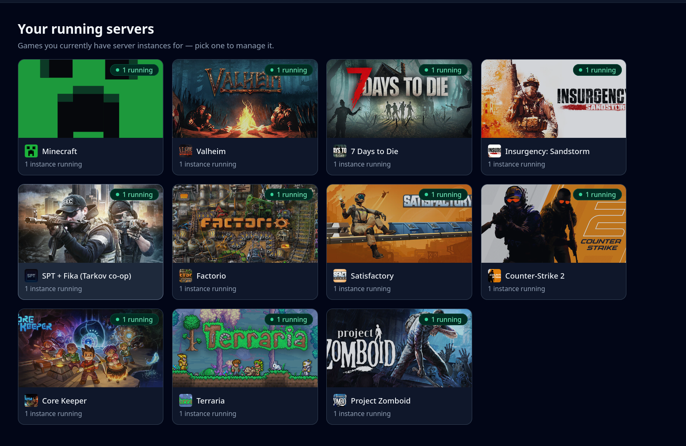
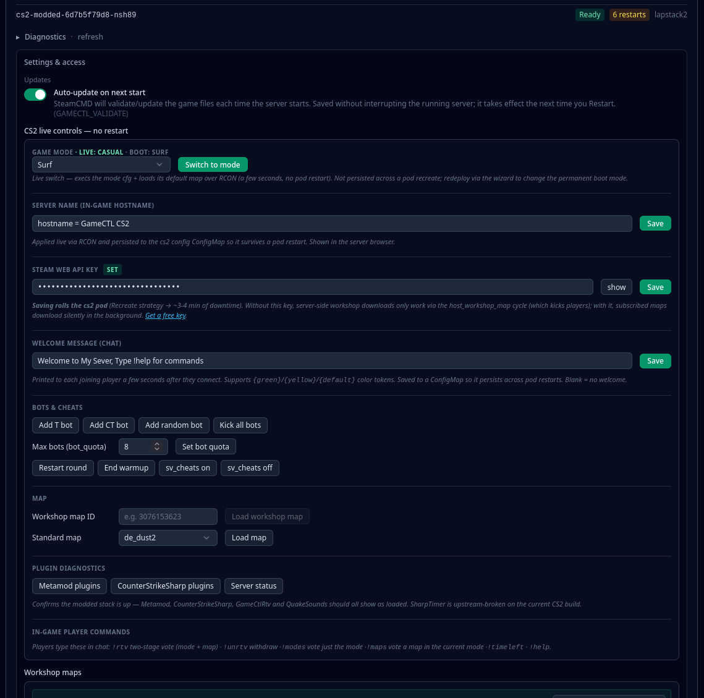
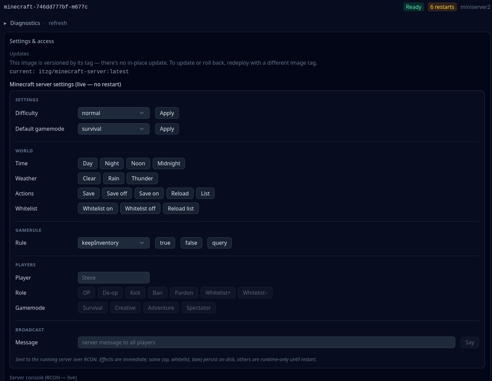
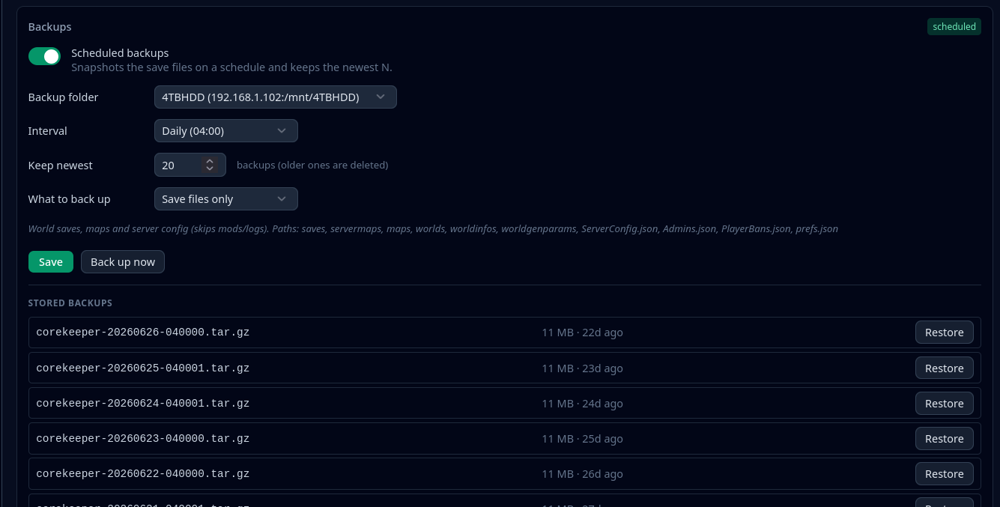
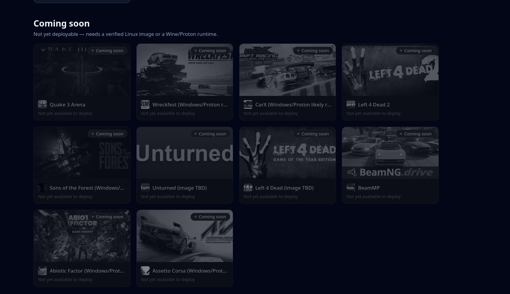

<div align="center">


**Self-hosted game server orchestration for Kubernetes.**

Deploy, manage, and monitor dedicated game servers from a single binary —
a guided wizard, live task tracking, and real server health, no YAML wrangling.

🌐 **[gamectl.cc](https://gamectl.cc)** &nbsp;·&nbsp; 🚀 **Public beta — `v0.0.42-beta`** &nbsp;·&nbsp; 🔗 **Sibling: [ProxyCTL](https://proxyctl.cc)** — host your servers on the internet, securely

</div>

---

GameCTL turns "deploy a game server on Kubernetes" from a wall of manifests into a few clicks. It runs as one Go binary with an embedded React UI, talks to your cluster through an in-cluster ServiceAccount, and shows you exactly what it's doing every step of the way.

> **Beta software.** This is the public-facing core of GameCTL, currently
> at `v0.0.42-beta`. It's stable enough for day-to-day self-hosting and
> close in feel to a 1.0, but it is still beta — APIs, templates, and
> structure may change between beta revisions. See
> [`CHANGELOG.md`](CHANGELOG.md) for what shipped in each release; full
> project info and updates live at **[gamectl.cc](https://gamectl.cc)**.

---

## ⚡ Install

One command, against your current `kubectl` context:

```bash
curl -fsSL https://gamectl.cc/install.sh | bash
```

Zero config — it pulls the public image, detects your cluster's
networking (MetalLB / ingress), applies the manifest, and walks you
through first-run admin setup. Full walkthrough, options, and the
no-script manifest path are in the **Deploy to Kubernetes** section below.

> **Tested on [k3s](https://k3s.io/).** GameCTL targets any conformant Kubernetes 1.28+,
> but the installer's bootstrap helpers (auto-detected ingress,
> optional MetalLB install, k3s kubeconfig-permission fix) are shaped
> around k3s — the easiest path from "blank Linux box" to "running
> GameCTL". Other distros (microk8s, kubeadm, EKS/GKE/AKS, kind) work
> too; you may skip the MetalLB step on cloud providers and provide
> your own kubeconfig.

> `https://gamectl.cc/install.sh` is a 302 redirect to the canonical
> script at `raw.githubusercontent.com/GameCTL-HQ/GameCTL/main/scripts/install.sh`,
> which also keeps working directly if you prefer the raw URL.

---

## ✨ Why GameCTL

- **A few clicks, not a wall of YAML** — per-game wizards with sane, overridable defaults
- **First-party server images** — every title runs GameCTL's own from-scratch image, built in public and published to GHCR
- **Watchable operations** — every apply and delete is a tracked, phase-by-phase background task
- **Honest lifecycle** — deletes actually clean up, and only ever touch resources GameCTL owns
- **Live server health** — real game-protocol probes, not just "pod is running"
- **Live in-game controls** — per-game RCON panels change settings on the running server, no restart
- **Scheduled backups** — snapshot save data on a schedule, keep the newest N, restore in one click
- **Uptime you can read** — heartbeat graphs, CPU/RAM trends, and Discord alerts when something goes unreachable
- **One binary** — API + UI in a single container; nothing else to host
- **Homelab-friendly, cluster-ready** — scales from a single node to multi-node Kubernetes

---

## 📸 Screenshots

<p align="center">
  <br>
  <em>The hub — every game you're running, live instance counts, one click to manage</em>
</p>

<table>
  <tr>
    <td width="50%" valign="top">
      <br>
      <em>Guided per-game deploy wizard</em>
    </td>
    <td width="50%" valign="top">
      <br>
      <em>Live status, streaming logs &amp; lifecycle controls</em>
    </td>
  </tr>
  <tr>
    <td width="50%" valign="top">
      <br>
      <em>CS2 live controls — mode switching, bots, workshop maps, plugin diagnostics</em>
    </td>
    <td width="50%" valign="top">
      <br>
      <em>Minecraft live settings over RCON — world, gamerules, players, broadcast</em>
    </td>
  </tr>
</table>

---

## 🔧 Feature Set

### 🧙 Uniform Multi-Step Deploy Wizard
- Every game uses the **same guided flow** — general → storage → networking
  → review — driven by per-game schemas, so a new title feels familiar
- Generates complete, inspectable manifests (Namespace, PV, PVC, Deployment, Service)
- The review step shows the exact YAML before anything touches the cluster
- NFS or local `hostPath` storage modes; the target directory is
  **auto-provisioned on first deploy** so there's no manual `mkdir`/`chown` dance
- On a successful deploy, a short countdown hands you **straight into the
  manage screen** for the new server — no hunting for it afterward

### ⏳ Background Task System
- Apply and delete run **asynchronously** — no frozen "Applying…" spinner, no silent timeouts
- A header **Tasks** menu shows live progress from any page
- Every task breaks into **phases** with per-step status and timing:
  `Ensure NFS path …` → `Apply Namespace/…` → `Apply Deployment/…` → done
- Click any task for a detail view that streams updates until it completes
- Long-running tasks can be **cancelled** mid-flight from the task view

### 🗂 Safe, Complete Lifecycle Management
- **Delete is a full sweep** — Deployment, Service, PVC, PV, and Namespace
- Waits for resources to truly terminate before reporting success, so the UI matches reality
- **Ownership-guarded** — only namespaces labeled as GameCTL-managed can be removed; an unrelated namespace can never be wiped by accident
- Delete is a **tracked task** — same phase-by-phase progress as deploy, so you watch it tear down
- Optional **"also delete data"** toggle — off by default, so world/save
  data survives a redeploy; when on, the backing NFS/local directory is
  wiped too
- Per-game manage screen: scale, stop/start, inspect pods, tail logs

### 🔄 Per-Instance Updates & Credentials
- Each server's manage screen has an **Updates & credentials** panel
- A per-instance **auto-update toggle** controls whether the server pulls
  a newer game-server image / runs its update path on (re)start, per game
- Update controls are wired to the env vars each game's image actually
  reads (e.g. SteamCMD-backed titles), so the toggle does what it says
- Server credentials/connection details are surfaced in one place instead
  of being buried in pod env

### 🎛 Live In-Game Controls (no restart)
- Per-game control panels driven over **RCON** — changes land on the *running*
  server in seconds, no pod recreate
- **Minecraft** — difficulty, gamemode, time/weather, gamerules, whitelist,
  op/kick/ban, broadcast, live server console
- **CS2** — live game-mode switching (casual / surf / …), server hostname,
  welcome message, bot controls, workshop map loading, Metamod /
  CounterStrikeSharp plugin diagnostics, in-game `!rtv` map voting
- Settings that matter are persisted to ConfigMaps so they survive pod restarts

### 💾 Scheduled Backups & Restore
- Per-instance **scheduled backups** to any operator-declared storage location
- Keep-newest-N retention — old snapshots are pruned automatically
- **Save files only** or full-data modes (worlds/saves/config, skipping mods & logs)
- One-click **Back up now** and one-click **Restore** from any stored snapshot

<p align="center">
  <br>
  <em>Scheduled backups — folder, interval, retention, and one-click restore</em>
</p>

### 📦 First-Party Game Images
- Every supported title runs **GameCTL's own from-scratch server image** —
  built in public in per-game repos and published to GHCR
  (`ghcr.io/gamectl-hq/<game>-kube`)
- Kubernetes-first by design: UID/GID 1000, NFS-friendly, predictable
  update behavior — no waiting on third-party image maintainers
- Any image can still be overridden in the wizard

### 📈 Monitoring, Uptime & Alerts
- **Heartbeat uptime graphs** everywhere — one bar per time bucket, green
  when every check in it passed, so an outage reads as an outage instead of
  an impossibly fast response. Latency is its own line, built only from
  samples that actually answered
- **CPU / RAM graphs** per server with a duration control, shown as a
  percentage of the configured limit; optional mini-graphs on hub cards
- **History survives restarts** — snapshots are persisted, so a redeploy
  doesn't wipe your graphs
- **Discord alerting** on reachability changes, with a configurable
  retention window and a test-webhook button
- When a server is published through ProxyCTL, its card also shows the
  **external** uptime ProxyCTL measures — not just in-cluster health

### 🎚 Resource Controls That Can't Bite You
- Kubernetes quantities are easy to get wrong in ways the API accepts
  silently (`2G` is two billion bytes, not 2Gi; a bare `2` for memory means
  two *bytes*). Both the wizard's Resources step and the manage screen use
  **plus/minus steppers** — CPU in millicores, memory in half-Gi increments —
  that emit a valid quantity every time and say what it means in plain
  language
- Minecraft's JVM heap is a whole-GB stepper that shows the container limit
  it implies as you change it
- The manage screen refuses to apply a request that exceeds its limit

### 📊 Public Stats API (opt-in)
- A separate, read-only endpoint that publishes the servers you explicitly
  advertise — player counts, status, connection details
- Gated by its **own token with its own signing key**, deliberately distinct
  from the admin JWT: a stats token can never act as an admin, and an admin
  token is never accepted there
- Issue, rotate, and revoke it from the Stats API screen. Details in
  [`docs/STATS_API.md`](docs/STATS_API.md)

### 🩺 Live Server Health
- Synthesized status pills — `Online`, `Initializing`, `Crash loop`, `Image pull failed`, …
- Pluggable deep-protocol probes that report version / players / MOTD,
  not just "pod is running":
  - **Minecraft** — Server List Ping
  - **Source / Steam A2S** — CS2, 7 Days to Die, Project Zomboid, and other
    Steam query–enabled titles
  - **Quake 3** — native getstatus protocol
  - **Valheim / Factorio** and other titles via a tuned **TCP/UDP**
    port-open check, plus generic **HTTP(S)** health checks
- Standalone **Steam A2S monitor** to query any server by address

### 🧩 Single-Binary, Kubernetes-Native
- One Go binary serves the API (`/api/*`) and the embedded React bundle (`/`)
- One container, one Service, one Ingress
- In-cluster ServiceAccount — no kubeconfig to distribute
- **In-app release notes** ("What's new") keyed to the running build, so
  you always see what changed in the version you're actually on
- Works with [k3s](https://k3s.io/) / vanilla Kubernetes, MetalLB / NodePort / LoadBalancer, and NFS-backed volumes — k3s is what GameCTL is developed and run on day to day

---

## 🎮 Supported Games

**22 games deployable today — every one of them on GameCTL's own
first-party image.** No community images: each game is built from scratch in
its own public repo (`GameCTL-HQ/<Game>-Kube`) from first-party sources
(official base images, the publisher's own download or Valve's SteamCMD) and
published to `ghcr.io/gamectl-hq/<game>-kube`, so nothing changes underneath
you and you can read exactly what runs.

| Game | Server image | Status |
|---|---|---|
| Minecraft (Java, modded-friendly, optional BlueMap) | `minecraft-kube` | ✅ Supported |
| CS2 (Counter-Strike 2, modded — Metamod/CounterStrikeSharp) | `cs2-kube` | ✅ Supported |
| SPT + Fika (Tarkov co-op) | `tarkov-spt-castro-fika-kube` | ✅ Supported |
| Insurgency: Sandstorm | `sandstorm-kube` | ✅ Supported |
| Satisfactory | `satisfactory-kube` | ✅ Supported |
| Valheim | `valheim-kube` | ✅ Supported |
| Factorio | `factorio-kube` | ✅ Supported |
| 7 Days to Die | `sevendays-kube` | ✅ Supported |
| Core Keeper | `corekeeper-kube` | ✅ Supported |
| Terraria | `terraria-kube` | ✅ Supported |
| Project Zomboid | `zomboid-kube` | ✅ Supported |
| Necesse | `necesse-kube` | ✅ Supported |
| Barotrauma | `barotrauma-kube` | ✅ Supported |
| Quake 3 Arena | `quake3-kube` | ✅ Supported |
| Left 4 Dead | `left4dead-kube` | ✅ Supported |
| Left 4 Dead 2 | `left4dead2-kube` | ✅ Supported |
| BeamMP | `beammp-kube` | ✅ Supported |
| Sons of the Forest | `sonsoftheforest-kube` | ✅ Supported |
| Unturned | `unturned-kube` | ✅ Supported |
| Wreckfest | `wreckfest-kube` | ✅ Supported |
| Wreckfest 2 *(Windows server under Wine)* | `wreckfest2-kube` | ✅ Supported |
| Abiotic Factor *(Windows server under Wine)* | `abioticfactor-kube` | ✅ Supported |
| CarX Drift Racing Online | — | 🔜 Coming soon *(no public dedicated server)* |
| Assetto Corsa *(Windows/Proton)* | — | 🔜 Coming soon |

*Games marked "Coming soon" appear in the hub greyed out and aren't
deployable yet — the wizard is intentionally locked for them until a
known-good server image is wired up.*

<p align="center">
  <br>
  <em>Coming-soon titles sit greyed out in the hub until their image is ready</em>
</p>

*Windows-only dedicated servers run under a Wine runtime layer — **Wreckfest
2** was the first, **Abiotic Factor** followed, and the same pattern is how
remaining Windows-only titles will land.*

*Adding a game is a self-contained generator + schema — no core changes
required. Deployable games are an explicit **allowlist**: a new title stays
invisible in the deploy picker until it has been deployed and verified
against a real cluster, so a half-finished generator can never silently
publish itself.*

---

## 🏗 Architecture

```
browser ──► gamectl (one Go binary)
              ├─ embed.FS   serves the React UI at /
              └─ chi router serves the API at /api/*
                       │
                       └─ in-cluster ServiceAccount
                          ──► Kubernetes API
```

| Path | Source |
|---|---|
| `server/` | Go backend — chi router, JWT auth, client-go, in-memory task store |
| `kubeUI/` | React 19 + Vite + Tailwind frontend |
| `k8s/` | Single-shot cluster manifest + deploy runbook |

The React bundle is compiled into the binary via `//go:embed` — one image, no separate frontend hosting.

---

## ☸️ Deploy to Kubernetes (from scratch)

GameCTL ships **secure-by-default** — no `admin/admin`, and **no secrets to
hand-craft**. A single manifest creates everything (Namespace,
ServiceAccount, ClusterRole + binding, Deployment, Service, Ingress); GameCTL
provisions its own auth Secret during first-run setup.

> **Two networking planes — read this first.** Reaching the GameCTL **web UI**
> and exposing the **game servers** GameCTL deploys are *separate* concerns.
> Game servers are always MetalLB `LoadBalancer` Services (raw TCP/UDP can't
> traverse an HTTP ingress). The UI can use an Ingress *or* a MetalLB IP —
> the install script detects what your cluster has and picks for you.
> MetalLB (IPs) and NFS (data) are the current backbone; alternative
> LoadBalancer and storage backends are on the roadmap.

### Option 1 — install script (recommended)

One command. It pulls the public image, detects MetalLB / ingress
controllers, picks how to expose the UI, applies the manifest, and hands
you to first-run setup. You never hand-craft a Kubernetes Secret — GameCTL
creates its own (see **Security & secrets** below).

```bash
curl -fsSL https://gamectl.cc/install.sh | bash
```

That's it — zero config, runs against your current `kubectl` context.
(`https://gamectl.cc/install.sh` is a 302 redirect to the canonical
`raw.githubusercontent.com/GameCTL-HQ/GameCTL/main/scripts/install.sh`,
which also works directly if you prefer the raw URL.)

**Optional overrides** — set any of these before the command (or
`export` them) to customise; all are optional:

```bash
GAMECTL_HOST=gamectl.example.com \
GAMECTL_STORAGE_LOCATIONS='name=ssd,server=10.0.0.20,path=/mnt/ssd' \
  bash -c "$(curl -fsSL https://gamectl.cc/install.sh)"
```

| Env | Purpose |
|---|---|
| `GAMECTL_IMAGE` | Optional. Override the image; defaults to the public `ghcr.io/gamectl-hq/gamectl:latest`. |
| `GAMECTL_HOST` | UI hostname for Ingress mode (must resolve to your ingress controller). |
| `GAMECTL_STORAGE_LOCATIONS` | Optional. Pre-seeds operator-declared storage locations so the deploy wizard has somewhere to put game data on day one. `;`-separate multiple: `name=ssd,server=10.0.0.20,path=/mnt/ssd ; name=hdd,type=local,path=/mnt/hdd,suffix=media`. |
| `GAMECTL_ASSUME_YES=1` | Optional. Skip interactive prompts (CI/automation). |

> **Storage Locations.** Game data lives on operator-declared NFS or local
> paths, managed in the UI's **Storage** screen (persisted to the
> `gamectl-storage` ConfigMap). If you don't seed any with the env var above,
> GameCTL nudges you to add one on first run — you can't deploy a game until
> at least one location exists. Each server's data lands at
> `<export>/GameCTL[-suffix]/<server-name>`.

### Option 2 — plain manifest (no script)

For people who'd rather not run a script:

```bash
# Edit k8s/deploy-gamectl.yaml first: set `image:` to one your cluster can
# pull, and the Ingress `host:` / `ingressClassName:` (or switch to a
# MetalLB LoadBalancer — see the inline comments in that file).
kubectl apply -f k8s/deploy-gamectl.yaml
```

### Finish setup (both options end here)

```bash
# 1. The pod starts in locked FIRST-RUN SETUP MODE (no auth Secret yet).
#    Read the one-time bootstrap token from the pod log:
kubectl -n gamectl logs deploy/gamectl | grep -i "BOOTSTRAP TOKEN"
```

2. Open the UI (the Ingress host, or the MetalLB IP — the script prints the
   exact URL). The setup screen asks for that bootstrap token plus a new
   admin username and password (min 8 chars). On submit, GameCTL bcrypts the
   password, generates a strong JWT secret, writes the `gamectl-auth` Secret
   itself via its ServiceAccount, and logs you straight in. No restart, no
   `kubectl create secret`.

### Upgrading (in place — no re-auth, no data loss)

To move to a newer GameCTL build, **do not delete anything**. Either
re-run the installer, or just restart the rollout:

```bash
# pulls the freshly published :latest and rolling-restarts in place
kubectl -n gamectl rollout restart deployment gamectl
kubectl -n gamectl rollout status deployment gamectl
```

This is a rolling update of the GameCTL Deployment only. The
`gamectl-auth` Secret persists, so **you are not asked to set up an admin
again** and existing logins keep working. **Your deployed game servers
are untouched** — they're separate workloads in the same namespace.
(Pinning a version tag instead of `:latest` works too — `kubectl -n
gamectl set image deployment/gamectl gamectl=ghcr.io/gamectl-hq/gamectl:vX.Y.Z`.)

### Tear down / start over

> Only do this for a full reset. It **deletes the namespace, the auth
> Secret, and every game server in it**, and the next deploy issues a new
> bootstrap token. For routine updates use **Upgrading** above instead.

```bash
kubectl delete -f k8s/deploy-gamectl.yaml
```

Removes the namespace (Deployment, Service, Ingress, ServiceAccount, and the
GameCTL-created `gamectl-auth` Secret) plus the cluster-scoped ClusterRole and
ClusterRoleBinding — a complete clean slate. Re-deploying returns you to the
bootstrap-token step with a fresh token.

---

## 🔐 Security & secrets

GameCTL is **secure-by-default** — there is no `admin/admin`, and **you never
create a Kubernetes Secret by hand**. That does *not* mean no Secret exists:

- Exactly **one** Secret, `gamectl-auth`, lives in the single `gamectl`
  namespace.
- **GameCTL creates it itself** at first-run, through its own ServiceAccount
  (a namespaced RBAC Role grants it `create`/`get` on Secrets in that one
  namespace — nothing cluster-wide for credentials).
- Flow: pod starts with no auth Secret → logs a one-time **bootstrap token**
  → you enter that token + a new admin username/password (min 8 chars) in
  the setup screen → GameCTL bcrypts the password, generates a JWT signing
  key, and writes `gamectl-auth` for you. No restart, no `kubectl create
  secret`, no credentials in the manifest or install script.

Tearing down with `kubectl delete -f k8s/deploy-gamectl.yaml` also removes
that GameCTL-created Secret — a clean slate; redeploying issues a fresh
bootstrap token.

## 💾 Storage prerequisites

Storage access is **independent of your kubeconfig user and the
ServiceAccount** (those only talk to the Kubernetes API). Two layers matter:

- **Mount** — the cluster *node's* kubelet performs the NFS mount, so your
  **NFS export must allow the cluster nodes' IPs**. The user running the
  installer needs no filesystem access at all.
- **Read/write** — game server pods run as **UID/GID 1000** (set via pod
  `securityContext`; a few images use their own default user). The target
  directory must be **writable by UID/GID 1000** — `chown 1000:1000` the
  path or export it accordingly. Pods run as 1000 by design because NFS
  `root_squash` typically blocks in-container root. GameCTL pre-creates each
  server's subdirectory automatically.
- **Importing files** — copying worlds, saves, or configs onto the share **as
  any user (including root) is supported**: GameCTL-HQ images fix the
  ownership of any mismatched files under their data directory at pod start,
  so a restart after copying is all it takes. (Requires an export where
  in-container root can chown, i.e. `no_root_squash`; on squashed exports,
  copy as UID 1000 instead. The Sandstorm image never runs as root and can't
  self-heal — keep its files owned by UID 1000.)
- **Local (`hostPath`)** — the path is on a node's own disk; on a
  multi-node cluster it only exists on whichever node the pod lands on, so
  treat local storage as effectively single-node.

Data lands at `<export>/GameCTL[-suffix]/<server-name>`.

---

## 🧪 What This Repo Is (and Is Not)

**It is:** a public snapshot of the GameCTL core, a reference implementation, and a statement of design direction.

**It is not:** a hosted SaaS, a hardened production control plane, or a guarantee of long-term API stability.

---

## 🌍 Going public? Pair it with ProxyCTL

GameCTL runs the servers — **[ProxyCTL](https://proxyctl.cc)** puts them on
the internet, **securely**. Raw game ports ride a WireGuard tunnel through
a cheap VPS; web apps get one-click Cloudflare Tunnel with free TLS + DDoS
protection — all **without opening a single port on your router**. Same
single-binary design, same one-command install:

```bash
curl -fsSL https://proxyctl.cc/install.sh | bash
```

Better yet, GameCTL **integrates with it directly**. When a ProxyCTL
install is detected in your cluster:

- Every server's **Networking panel** shows both paths side by side — the
  LAN (MetalLB) address and the public (ProxyCTL) one — and lets you
  **publish from GameCTL**: link ProxyCTL once (URL + its login, saved in a
  Secret), then pick `subdomain` + one of your ProxyCTL domains and hit
  Publish. GameCTL creates the tunnel entry (ports auto-derived from the
  game's Service, targeting its live ClusterIP) and triggers ProxyCTL's
  Apply — DNS included when ProxyCTL has your Cloudflare token.
- The deploy wizard's Networking step grows a **Player access** choice:
  **LAN**, **LAN + Internet**, or **Internet only** — the last one skips
  MetalLB entirely (the Service stays ClusterIP; ProxyCTL's in-cluster
  gateway reaches it directly), so a public-only server doesn't burn a
  LAN IP. At least one path is always selected.
- If the game Service's ClusterIP changes on a redeploy, the panel flags
  the drift and re-points ProxyCTL in one click.
- **Egress-mode publish (automatic where needed).** Some games' server
  browsers (Wreckfest 2 / PlayFab) record the **server's outbound IP** and
  point players at it — an inbound tunnel alone would send joins to your
  home WAN. Games that need it are annotated `gamectl.io/publish-mode:
  egress` by their generator; publishing then also routes the server's own
  traffic through the droplet via a WireGuard sidecar in the game pod, so
  the browser advertises the droplet and joins ride the same tunnel back
  in. The keypair is generated by GameCTL and stays in a Secret in the
  game's namespace — ProxyCTL still never sees a private key. Notes: the
  pod restarts once on first publish; server downloads/updates then also
  ride the droplet (bandwidth); cluster/LAN traffic bypasses the tunnel
  via built-in CIDR exclusions (`10.42.0.0/16, 10.43.0.0/16,
  10.0.0.0/16, 172.16.0.0/12` — override with
  `gamectl.io/egress-exclude-cidrs` if your pod/Service/LAN ranges
  differ).

No ProxyCTL? Nothing changes — MetalLB remains the built-in path, and the
extra UI stays out of your way.

---

## 🛣 Roadmap

- More first-party game images (Windows-only servers under Wine, following Wreckfest 2 and Abiotic Factor)
- Expanded game template library
- **More networking & storage backends** — MetalLB + NFS are the current
  defaults for game-server IPs and data; alternative LoadBalancer and
  storage providers are planned
- Role-based access control and per-server permissions
- Plugin / extension system

Some future features may be released under different licensing or distribution models.

---

## 📦 Server images

**GameCTL builds and ships its own game-server images — all of them.**
Every supported title runs a first-party, from-scratch image built in its own
public repo under [GameCTL-HQ](https://github.com/GameCTL-HQ) and published
to GHCR as `ghcr.io/gamectl-hq/<game>-kube`, maintained by the GameCTL
project end to end. No community images are used, so nothing changes
underneath you and the Dockerfile for anything you run is public.

Each image is built from first-party sources only: an official base image
(Debian, Temurin), plus either the publisher's own download or Valve's
official SteamCMD. Windows-only servers (currently Wreckfest 2 and Abiotic
Factor) run under WineHQ's official builds. Any image can still be overridden in the wizard if
you'd rather run your own. The game servers themselves and the games remain
the property of their respective owners, governed by their own licenses and
each game's EULA.

### Trademarks & artwork

Game names, logos, and cover artwork are trademarks/copyright of their
respective publishers, used here **for identification only**. GameCTL is an
independent project and is **not affiliated with, endorsed by, or sponsored
by** any game publisher or image maintainer. You are responsible for
complying with each game server's license and the game's EULA when you
deploy it.

---

## 📜 Licensing

This repository — the **public core** of GameCTL — is released under the
**MIT License** (see [`LICENSE`](LICENSE)). The MIT license applies to
GameCTL's own source only; see **Server images** above — the games
themselves carry their own licenses and terms.

GameCTL follows an open-core model: this public core is MIT, while additional
features, hosted services, or extensions may be developed and licensed
separately.

---

## 🤝 Contributions

GameCTL is primarily developed by its author. Feedback, issues, and discussions are welcome; contribution guidelines may evolve as the project stabilizes.

---

## 🧠 Philosophy

Built by and for people who run their own infrastructure, prefer control over convenience, want repeatable and inspectable deployments, and believe game servers deserve better tooling.

---

<div align="center">

**Public beta `v0.0.42-beta`** · Active development · Interfaces, templates, and structure subject to change

🌐 **[gamectl.cc](https://gamectl.cc)** · 🚀 Public beta

</div>
